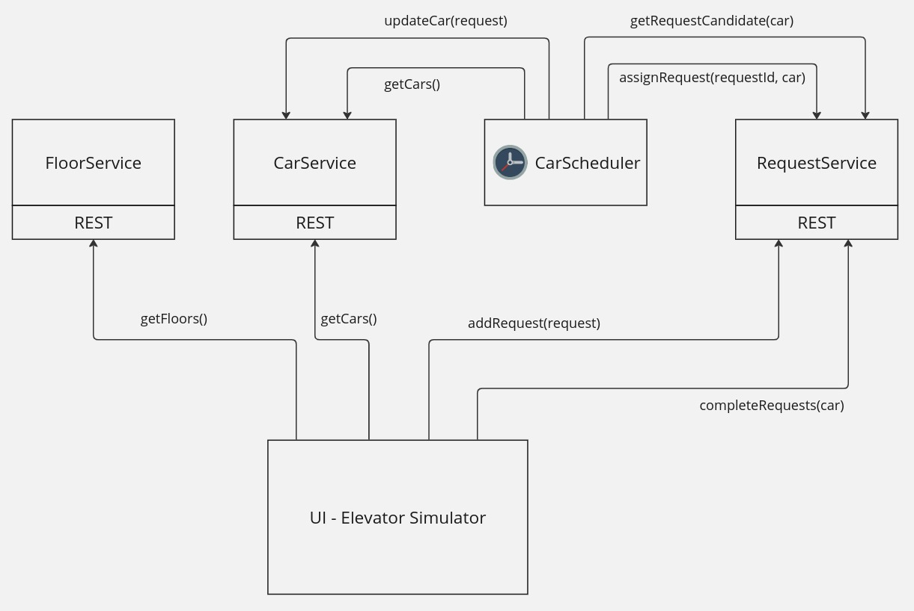
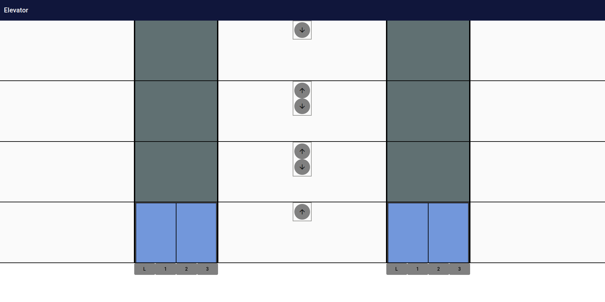
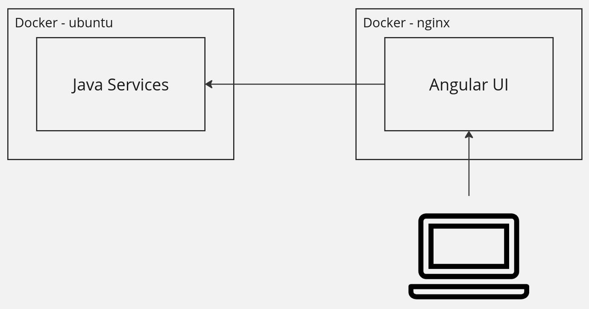

# Elevator

The elevator app implements elevator logic in Java and provides a REST API to access elevator cars, floors, and requests for service.
This project also includes an angular UI to simulate the elevator system.

## Prerequisites

* Java (JDK 17)
* Maven
* Docker
* Docker Compose
* GNU Make (optional)

## Build the app

Run the maven build, which produces a service docker and UI docker.

```
# Runs mvn clean install
make mvn
```

## Run the app

Run the docker compose app. This runs `docker-compose up -d` and tails the server logs

```
make up
```

Access the UI at [http://localhost:8210/app/elevator](http://localhost:8210/app/elevator)

## Service Overview



## UI Overview

The UI simulates an elevator, and leverages the Java services via REST for building state (i.e. number of floors),
car state (i.e. how many cars, what floor they're on), and requests (i.e. calling the elevator to a floor.).



## Deployment
Both the Java services and UI are packaged as Docker images.



## Assumptions

* Initially we will have 4 floors and 2 cars.
  * In the future we can add support for a configurable number of floors and cars. (The service already supports this, but the UI would need some work.)
* Requests can come from a floor (Ex: Pick me up from floor 3 and take me down)
* Requests can come from inside the car (Ex: I'm in the car, take me to floor 2)
* Cars should prioritize requests efficiently. For Ex:
  * Prioritize the closest request in the car's direction, wanting to go in the same direction (or wanting to get out of the car). Ex: If I'm moving up, I should keep moving up if there are more unassigned requests above that also want to go up. But I should also let any passengers out along the way.
  * Next prioritize the furthest request in the car's direction, wanting to go the opposite direction. Ex: If I'm moving up, get the furthest request above me that wants to go down.
  * Next prioritize the closest internal request (from people in the car). This means if someone gets in a car going up, and pushes the Lobby button, they will have to wait until all UP requests are serviced. The passenger can avoid this by instead getting into a car that is going down.
  * If no request matches the above criteria, just service the closest request to the car.
* Multiple cars should never be assigned the same request.
* 2 requests from the same floor in different directions should be treated as separate requests.
* Internal requests can only be assigned to the car it originated from. Ex: If I'm in car 1 and press floor 3, only car 1 can service that request.

## Future work

- Svc: Could deduplicate requests if multiple identical requests are queued.
- Svc: Make java objects immutable (progress).
- Svc: Handle read/write concurrency when accessing floors / cars / requests. (progress)
- Svc: Unit test all services. Example unit tests are written for `DefaultCarScheduler` and `DefaultRequestService`.
  - The `DefaultRequestService.getRequestCandidate()` is fun to test since it has simple input/output, but complex internal logic. The parameterized test is written so that it can easily be expanded with more use cases.
- Svc/UI: Use websockets for push notifications so that the UI does not have to poll for request updates and car assignments.
- UI: Automate e2e tests using playwright.
- UI: Need dynamic layout for configurable number of cars / floors. Currently, the UI assumes a default number of floors (4) and cars (2). (progress)
- UI: Split the `BuildingComponent` into several smaller components. For example, create and compose the following new components:
  - `InternalButtonComponent` (progress)
  - `FloorComponent` (progress)
  - `CarComponent` (progress)
  - `FloorButtonPanelComponent`
- UI: Add car direction indicators when a car arrives at a floor.
- UI: Add a feature to enable/disable a car. When disabled, a car should:
  - Open its doors to let any passengers out
  - Un-assign any assigned external requests, making them candidates for other (enabled) cars.
  - Drop (delete) all internal requests
  - Stop receiving new requests -- they should only be routed to other (enabled) cars.
  - Have an indicator that it is disabled.
- UI: Handle if more than 1 browser is connected to the service.
- Test and bugfix.
