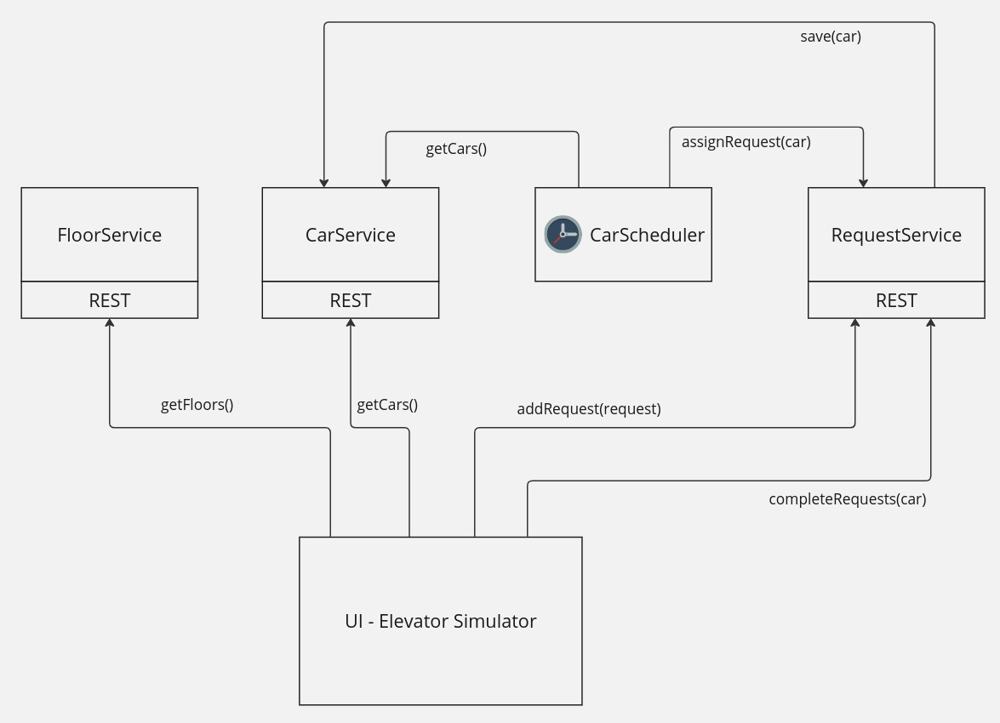
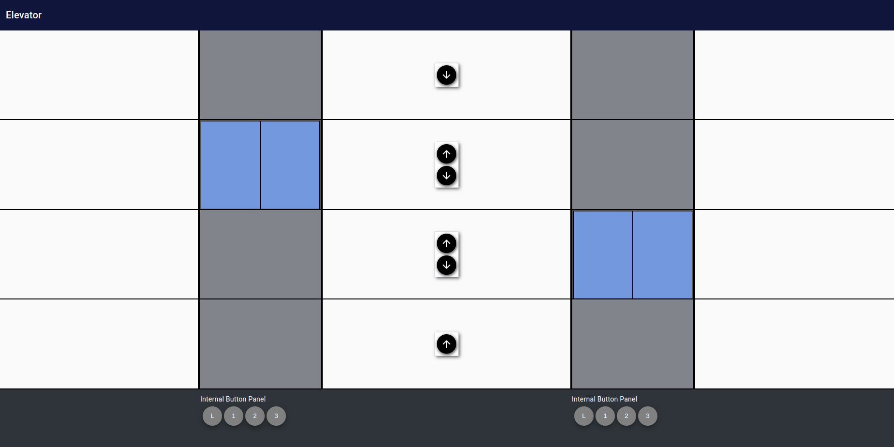

# Elevator

The elevator app implements an elevator in Java with REST access to elevator cars, building floors, and requests for service.
This project also includes an angular UI to simulate and test the service logic.

## Assumptions

* Initially we will have 4 floors and 2 cars.
  * In the future we can add support for a configurable number of floors and cars. (The service already supports this, but the UI would need some work.)
* Requests can come from a floor (Ex: Pick me up from floor 3 and take me down) 
* Requests can come from inside the car (Ex: I'm in the car, take me to floor 2)
* Cars should prioritize requests efficiently. For Ex:
  * Prioritize the closest request in their direction, wanting to go in the same direction. Ex: If I'm moving up, I should keep moving up if there are more unassigned requests above that also want to go up.
  * Next prioritize the furthest request in their direction, wanting to go the opposite direction. Ex: If I'm moving up, get the furthest request above me that wants to go down.
  * Next prioritize the closest internal request (from people in the car). This means if someone gets in a car going up, and pushes the Lobby button, they will have to wait until all UP requests are serviced. The passenger can avoid this by instead getting into a car that is going down.
  * Next just pick the closest request and service it.
* Multiple cars should never be assigned the same request.
* Internal requests can only be assigned to the car it originated from. Ex: If I'm in car 1 and press floor 3, only car 1 can service that request.

## Prerequisites

* Java (JDK 17)
* Maven
* Docker
* Docker Compose
* GNU Make (optional)

## Build the app

Run the maven build, which produces a service docker and UI docker.

```
# Runs mvn clean install
make mvn
```

## Run the app

Run the docker compose app. This runs `docker-compose up -d` and tails the server logs

```
make up
```

Access the UI at [http://localhost:8210/app/elevator](http://localhost:8210/app/elevator)

## Service Details



## UI Details

The UI simulates an elevator, and leverages the Java services via REST for building state (i.e. number of floors),
car state (i.e. how many cars, what floor they're on), and managing requests (i.e. calling the elevator to a floor.).



## Deployment Overview
Both the Java services and UI are packaged as Docker containers.


## Future work

- Svc: Could deduplicate requests if the same request is added that already exists. Currently this isn't really an issue because both will be completed when either one is fulfilled.
- Svc: Make java objects immutable (done).
- Svc: Handle read/write concurrency when accessing floors / cars / requests. (done)
- Svc: Unit test all services. An example unit test is written for the DefaultCarScheduler.
  - Especially need to unit test the `DefaultRequestService.getRequestCandidate()` method since it has complex logic. Then the method could be simplified, using the passing unit test as confirmation. Then we can simplify the method and ensure all tests still pass.
- Svc/UI: Use websockets for push notifications so that the UI does not have to poll for request updates and car assignments.
- UI: Automate e2e tests using playwright
- UI: Need dynamic layout for configurable number of cars / floors. Currently there are some assumptions about based on default number of floors (4) and cars (2).
- UI: Split the `BuildingComponent` into several smaller components. For example, create and compose the following new components:
  - `InternalButtonComponent` (done)
  - `FloorComponent`
  - `ElevatorShaftComponent`
  - `CarComponent`
  - `FloorButtonPanelComponent`
- UI: Add car direction indicators when a car arrives at a floor.
- Test and bugfix.
